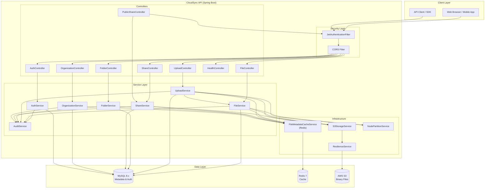
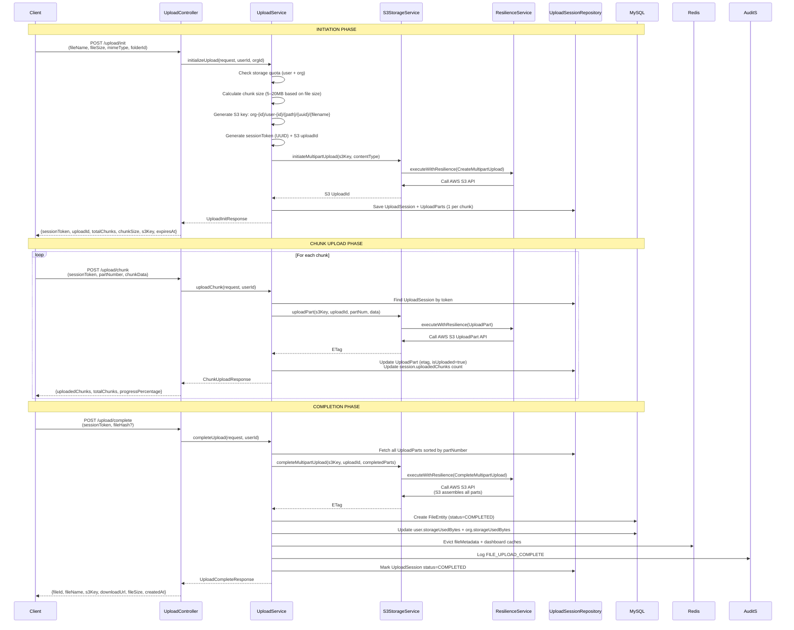
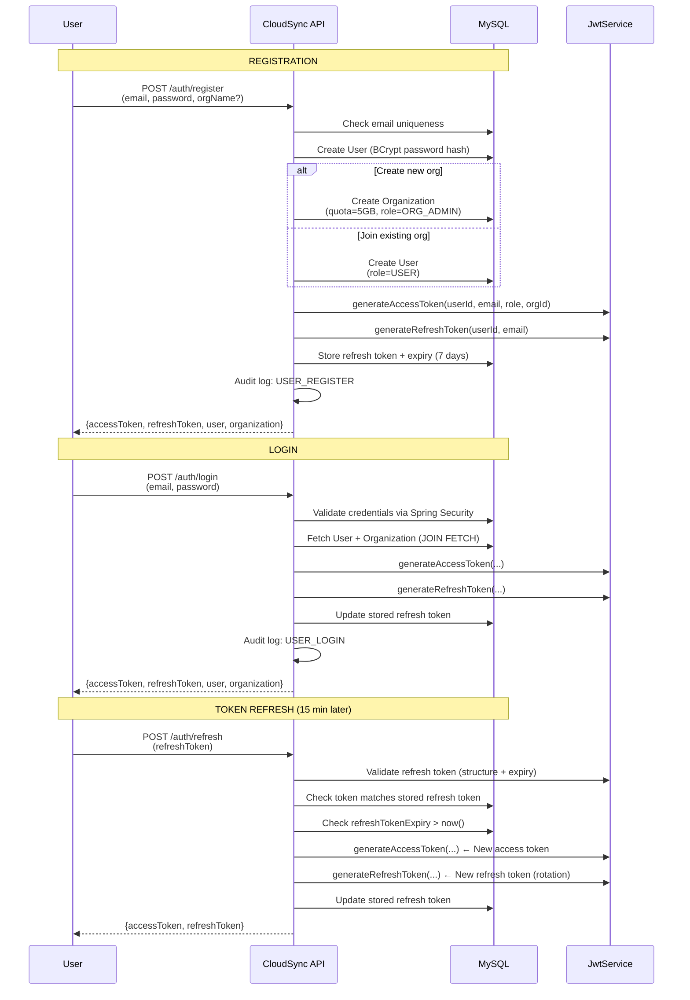
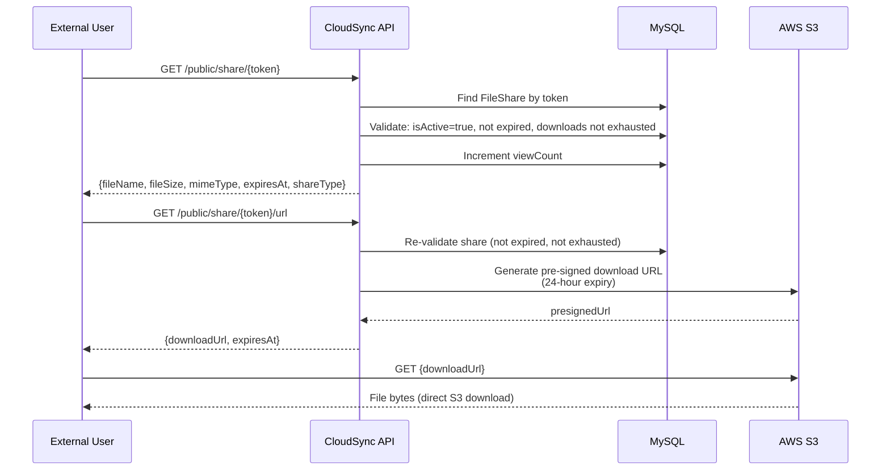
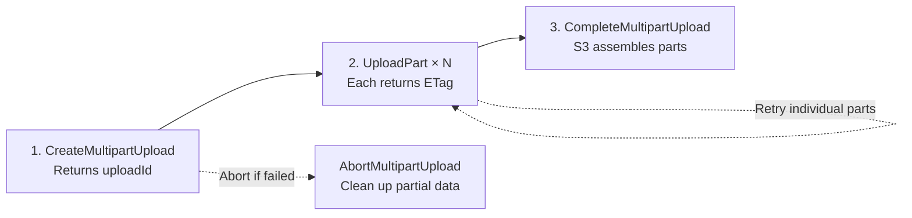

# CloudSync — Scalable File Storage System

A production-ready, fault-tolerant file storage system built with Java 17, Spring Boot, Redis, MySQL, and AWS S3. Supports multi-tenancy, resumable multipart uploads, JWT authentication, and more.

---

## Table of Contents

- [Overview](#overview)
- [Architecture](#architecture)
- [Technology Stack](#technology-stack)
- [Project Structure](#project-structure)
- [Authentication](#authentication)
- [File Upload & Download](#file-upload--download)
- [Resumable Multipart Upload](#resumable-multipart-upload)
- [Resuming After Internet Failure](#resuming-after-internet-failure)
- [Redis Caching](#redis-caching)
- [Resilience & Fault Tolerance](#resilience--fault-tolerance)
- [Database Schema](#database-schema)
- [API Endpoints](#api-endpoints)
- [Deployment](#deployment)
- [Configuration](#configuration)

---

## Overview

CloudSync is a scalable, fault-tolerant file storage platform with the following key capabilities:

- **Multi-tenant architecture** — Users belong to organizations with storage quotas
- **JWT authentication** — Access + refresh token model with rotation
- **Resumable uploads** — Multipart S3 uploads with chunk-level tracking; resume after any failure
- **Pre-signed URLs** — Serverless downloads directly from S3
- **Folder hierarchy** — Nested folder structure with materialized paths
- **File sharing** — Internal/external sharing with expiration and password protection
- **Redis caching** — Multi-layer caching for metadata with write-eviction
- **Circuit breaker + retries** — Resilience4j protecting all S3 operations
- **Consistent hashing** — Virtual-node partition ring for future multi-node scaling

---

## Architecture

### High-Level System Diagram



### Request/Response Flow — File Upload



### Authentication Flow



### Resumable Upload — Resume After Failure

```mermaid
sequenceDiagram
    participant C as Client
    participant API as CloudSync API
    participant DB as MySQL
    participant S3 as AWS S3

    Note over C,S3: INTERNET FAILURE — UPLOAD INTERRUPTED AT CHUNK 3

    rect rgb(40, 40, 60)
        Note over C,S3: PHASE 1: CHECK STATUS
        C->>API: GET /upload/status/{sessionToken}
        API->>DB: Find UploadSession<br/>Get uploadedChunks count
        API-->>C: {totalChunks: 10, uploadedChunks: 3,<br/>status: IN_PROGRESS, expiresAt: ...}

        Note over C,S3: PHASE 2: FIND PENDING CHUNKS
        C->>API: GET /upload/pending/{sessionToken}
        API->>DB: Find all UploadParts where isUploaded=false
        API-->>C: {pendingPartNumbers: [4, 5, 6, 7, 8, 9, 10]}

        Note over C,S3: PHASE 3: RESUME UPLOADING
        loop Resume from chunk 4
            C->>API: POST /upload/chunk<br/>(sessionToken, partNumber, chunkData)
            API->>API: Validate session not expired, not completed
            API->>S3: UploadPart (S3 uploadId still valid!)
            S3-->>API: ETag
            API->>DB: Update UploadPart (etag, isUploaded=true)
            API-->>C: {uploadedChunks: 4, progress: 40%}
        end

        Note over C,S3: PHASE 4: COMPLETE
        C->>API: POST /upload/complete<br/>(sessionToken)
        API->>S3: CompleteMultipartUpload<br/>(S3 assembles all 10 parts)
        API->>DB: Create FileEntity
        API-->>C: {fileId, downloadUrl}
    end
```



### Shared File Download Flow



---

## Technology Stack

| Component | Technology | Version |
|-----------|-----------|---------|
| Runtime | Java 17 (Eclipse Temurin) | LTS |
| Framework | Spring Boot | 3.2.x |
| Database | MySQL 8.x | 8.0 |
| Cache | Redis 7 (Alpine) | 7.x |
| Object Storage | AWS S3 SDK v2 | 2.25.x |
| Authentication | JWT (jjwt) | 0.12.5 |
| Resilience | Resilience4j | 2.2.0 |
| ORM | Spring Data JPA / Hibernate | — |
| Build | Maven | 3.x |
| API Docs | springdoc-openapi | 2.5.0 |
| Password | BCrypt | strength 12 |

---

## Project Structure

```
src/main/java/com/cloudsync/
├── CloudSyncApplication.java              # Main class (@EnableJpaAuditing, @EnableCaching, @EnableAsync, @EnableScheduling)
├── config/
│   ├── AsyncConfig.java                  # Thread pools (file-upload, s3-ops, audit)
│   ├── AwsS3Config.java                  # S3Client + S3Presigner beans
│   ├── CloudSyncProperties.java          # @ConfigurationProperties (cloudsync.*)
│   ├── OpenApiConfig.java                # Swagger/OpenAPI docs
│   ├── RedisConfig.java                  # RedisTemplate + CacheManager
│   ├── WebConfig.java                    # CORS + static resources
│   └── security/
│       └── SecurityConfig.java           # CSRF off, stateless sessions, route rules
├── controller/
│   ├── AuthController.java              # /api/auth
│   ├── FileController.java               # /api/files
│   ├── FolderController.java             # /api/folders
│   ├── HealthController.java             # /api/health
│   ├── OrganizationController.java       # /api/organizations
│   ├── PublicShareController.java        # /api/public/share
│   ├── ShareController.java              # /api/shares
│   └── UploadController.java             # /api/upload
├── service/
│   ├── AuditService.java                 # Async audit logging
│   ├── AuthService.java                  # Register, login, refresh, logout
│   ├── FileService.java                  # CRUD, search, dashboard, download
│   ├── FolderService.java                # Folder management + hierarchy
│   ├── OrganizationService.java          # Org management + quotas
│   ├── ShareService.java                 # Internal/external sharing
│   └── UploadService.java                # Multipart upload orchestration
├── repository/                           # Spring Data JPA repositories
├── model/
│   ├── entity/                           # JPA entities
│   └── enums/                            # FileStatus, Role, UploadStatus, ShareType
├── dto/
│   ├── common/                           # ApiResponse, PageResponse
│   ├── request/                          # Request DTOs
│   └── response/                         # Response DTOs
├── security/
│   ├── filter/
│   │   ├── AuthenticatedUser.java        # Principal (userId, email, role, orgId)
│   │   └── JwtAuthenticationFilter.java  # OncePerRequestFilter for JWT
│   └── service/
│       ├── CustomUserDetailsService.java # Spring Security user loading
│       └── JwtService.java               # Token generation, extraction, validation
├── cache/
│   └── FileMetadataCacheService.java    # Read-through + write-evict Redis cache
├── s3/
│   └── S3StorageService.java            # All S3 operations (wrapped by ResilienceService)
├── partition/
│   ├── ConsistentHashRing.java           # Virtual-node consistent hash ring
│   └── NodePartitionService.java         # Partitioning facade
├── resilience/
│   └── ResilienceService.java           # Circuit breaker + retry wrapper
├── exception/                           # Custom exceptions + GlobalExceptionHandler
└── util/
    ├── FileUtils.java                   # S3 key generation, chunk size calculation
    ├── RequestContext.java              # ThreadLocal request data (IP, user-agent, etc.)
    └── SecurityUtils.java              # Email/password validation
```

---

## Authentication

### Token Model

| Token | Lifetime | Storage | Purpose |
|-------|----------|---------|---------|
| Access Token | 15 minutes | Client memory | Every API call (Authorization: Bearer) |
| Refresh Token | 7 days (30 if rememberMe) | Database on User row | Renew access token |

JWTs are signed with **HS256** (HMAC SHA-256) using a Base64-encoded secret key. Claims include: `sub` (email), `userId`, `role`, `organizationId`, `jti`, `iat`, `exp`.

### Registration

Users can register in two ways:
1. **New organization** — Provide `orgName`, user becomes `ROLE_ORG_ADMIN` (quota: 5GB, max 10 users)
2. **Join existing** — Provide `organizationId`, user becomes `ROLE_USER`

### Token Refresh

Uses **refresh token rotation** — every refresh issues a new refresh token, and the old one is invalidated. This limits the blast radius of a leaked token: an attacker can only use a stolen refresh token once before it's revoked.

### Security Configuration

- CSRF: **disabled** (stateless JWT, no session cookies)
- Sessions: **STATELESS** (`SessionCreationPolicy.STATELESS`)
- Passwords: **BCrypt** with strength 12
- Public endpoints: `/auth/**`, `/public/**`, `/swagger-ui/**`, `/api-docs/**`, `/actuator/health`
- Admin endpoints: `/admin/**` require `ROLE_SUPER_ADMIN`

---

## File Upload & Download

### Upload Strategies

CloudSync supports two upload paths:

**1. Direct Upload (`POST /upload/direct`)**
- Single HTTP request for small files (≤ 10MB)
- File streamed as `MultipartFile` → `PutObject` to S3
- No session tracking, no resume capability

**2. Multipart Resumable Upload (3-phase)**
- Large files split into chunks (5–20MB each)
- Each chunk uploaded independently
- Any chunk can be retried individually
- Full session state persisted in MySQL + Redis

### S3 Key Generation

Files are stored at a deterministic S3 key:

```
org-{orgId}/user-{userId}/{folderPath}/{uuid}/{sanitized_filename}
```

Example: `org-5/user-12/Projects/backend/src/d41d8cd9/report-2024.pdf`

The UUID prefix ensures uniqueness even with filename collisions. The sanitized filename preserves readability for human-accessed buckets.

### Download

Two options:

1. **Server-streaming** (`GET /files/{id}/download`) — File bytes flow through the server: S3 → API → Client. Increments `downloadCount` in DB.
2. **Pre-signed URL** (`GET /files/{id}/url`) — Server generates a short-lived S3 pre-signed URL (default 1 hour). Client downloads directly from S3, offloading traffic from the API server.

---

## Resumable Multipart Upload

### Chunk Size Strategy

Chunk size adapts dynamically to total file size:

| File Size | Chunk Size |
|-----------|-----------|
| ≤ 5 MB | 5 MB |
| ≤ 100 MB | 10 MB |
| ≤ 1 GB | 15 MB |
| > 1 GB | 20 MB |

### S3 Multipart Upload Lifecycle



### Upload Session State Machine

```
INITIATED ──(chunks uploaded)──> IN_PROGRESS ──(all chunks done)──> COMPLETED
    │                                     │
    └───────(cancel/abort)────> CANCELLED │
    │
    └───────(session expired)──> FAILED
```

### Session Persistence

Every `UploadSession` and its `UploadPart` records are persisted to MySQL immediately:

- **UploadSession**: `sessionToken`, `uploadId` (S3), `totalChunks`, `uploadedChunks`, `status`, `expiresAt`
- **UploadPart**: `partNumber`, `etag` (S3 ETag), `isUploaded`, `byteStart`, `byteEnd`

This means the server can crash and restart, and resumptions still work — the client just calls `GET /upload/status/{token}` and continues.

### S3 Part Number Limit

S3 requires part numbers from 1 to 10,000. This means the maximum resumable upload size is:
- 10,000 parts × 20 MB/chunk = **200 GB** per upload

---

## Resuming After Internet Failure

The resume workflow is designed to be robust against any failure point:

### Step-by-Step Resume Process

```
1. Client calls GET /upload/status/{sessionToken}
   → Receives: totalChunks, uploadedChunks, sessionStatus, expiresAt

2. Client calls GET /upload/pending/{sessionToken}
   → Receives: list of partNumbers where isUploaded=false

3. Client re-uploads only the pending chunks
   → Each POST /upload/chunk is idempotent
   → S3 accepts duplicate parts with the same partNumber — it stores the last one

4. Client calls POST /upload/complete
   → Server assembles all parts via S3 CompleteMultipartUpload
```

### Key Resume Guarantees

| Scenario | Behavior |
|----------|----------|
| Upload interrupted mid-chunk | Chunk is not marked uploaded; re-upload it |
| Chunk uploaded but network failed before response | Chunk is marked uploaded; skip it |
| Client app restarted | `sessionToken` retrieved from local storage; call status endpoint |
| Server restarted mid-upload | UploadSession in MySQL; `uploadId` still valid in S3 |
| Session expired (24h default) | Server rejects with 410 Gone; must start over |
| S3 circuit breaker opens | Retry with exponential backoff; ResilienceService handles |

### Why S3 Multipart Resumability Works

1. S3's `CreateMultipartUpload` returns a persistent `uploadId`
2. This `uploadId` is stored in the `UploadSession.uploadId` column
3. Each `UploadPart` call references this `uploadId` + a `partNumber`
4. S3 holds uncommitted parts for up to 7 days
5. If the session expires, the server calls `AbortMultipartUpload` to clean up S3 storage
6. The scheduled cleanup job (`@Scheduled(fixedRate=3600000)`) auto-aborts expired sessions

---

## Redis Caching

### Cache Strategy: Write-Evict

CloudSync uses **read-through caching** with **immediate write-eviction**:

```
READ:  Cache miss → fetch from DB → populate cache → return
WRITE: Any create/update/delete → evict relevant cache entries → update DB
```

### Cache Configuration

| Cache Name | TTL | Purpose |
|------------|-----|---------|
| `fileMetadata` | 24 hours | File entity metadata (by ID and S3 key) |
| `userCache` | 6 hours | User profiles |
| `organizationCache` | 12 hours | Organization details |
| `folderCache` | 2 hours | Folder metadata + contents (by ID and path) |
| `uploadSession` | 30 minutes | Upload session state |
| `shareCache` | 1 hour | Share token lookups |
| `dashboard` | 10 minutes | Dashboard aggregates (storage usage) |

### Cache Key Patterns

```
fileMetadata:    file:{fileId}
fileMetadata:    s3key:{s3Key}
folderCache:     folder:{folderId}
folderCache:     path:{folderPath}
dashboard:       user:{userId}
shareCache:      share:{token}
```

### Eviction Triggers

| Operation | Evicted Caches |
|-----------|---------------|
| File upload complete | `fileMetadata`, `dashboard` |
| File delete/restore | `fileMetadata`, `dashboard` |
| File rename | `fileMetadata` |
| Folder create/rename/delete | `folderCache` |
| Share create/deactivate/view | `shareCache`, `fileMetadata` |
| Organization update | `organizationCache` |
| Storage usage update | `organizationCache`, `dashboard` |

---

## Resilience & Fault Tolerance

### Circuit Breaker (Resilience4j)

The `s3Operations` circuit breaker wraps all S3 calls:

```yaml
slidingWindowSize: 10              # Track last 10 calls
failureRateThreshold: 50           # Open at ≥50% failures
slowCallRateThreshold: 80         # Open at ≥80% slow calls
slowCallDurationThreshold: 5s      # "slow" = >5 seconds
waitDurationInOpenState: 30s      # Stay open for 30s
permittedCallsInHalfOpen: 3      # Allow 3 test calls
```

### Retry Policy

```
maxAttempts: 3
waitDuration: 1s base
exponentialBackoffMultiplier: 2    # 1s → 2s → 4s
retryExceptions: SdkClientException, IOException, SocketTimeoutException
ignoreExceptions: NoSuchKeyException (S3 "file not found" is not a retryable failure)
```

### ResilienceService

All S3 operations go through a single entry point:

```java
return resilienceService.executeWithResilience(() -> {
    return s3Client.uploadPart(request, body);
});
```

When the circuit breaker is **OPEN**, the API returns:
- HTTP `503 Service Unavailable`
- Body: `"Service temporarily unavailable. Please try again later."`

When the circuit breaker is **HALF_OPEN**, a limited number of requests are allowed through to test if S3 has recovered.

### Circuit Breaker Events

The system logs (at WARN/ERROR level):
- State transitions: CLOSED → OPEN → HALF_OPEN → CLOSED
- Failure/slow rate thresholds exceeded
- Retry attempts and exhaustion

### Thread Pools

Three dedicated thread pools prevent resource exhaustion:

| Pool | Core | Max | Queue | Use Case |
|------|------|-----|-------|---------|
| `fileUploadExecutor` | 10 | 50 | 500 | File I/O, multipart assembly |
| `s3OperationsExecutor` | 20 | 100 | 1000 | S3 API calls |
| `auditExecutor` | 5 | 20 | 1000 | Async audit logging |

---

## Database Schema

### Entity Relationships

```mermaid
erDiagram
    Organization ||--o{ User : "has"
    Organization ||--o{ FileEntity : "owns"
    Organization ||--o{ Folder : "owns"
    Organization ||--o{ UploadSession : "owns"

    User ||--o{ FileEntity : "owns"
    User ||--o{ Folder : "owns"
    User ||--o{ UploadSession : "initiates"
    User ||--o{ FileShare : "creates"
    User ||--o{ AuditLog : "triggers"

    Folder ||--o{ Folder : "parent"
    Folder ||--o{ FileEntity : "contains"

    FileEntity ||--o{ FileShare : "has"
    FileEntity ||--o{ UploadSession : "for"

    UploadSession ||--o{ UploadPart : "has"

    FileShare }o--|| User : "shared_with"
```



### Storage Quota Model

Every upload checks against two quotas:

```
User quota:      SUM(fileSize) WHERE owner_id = userId
Organization:    SUM(fileSize) WHERE organization_id = orgId

Before upload:   (orgUsedBytes + fileSize) <= orgQuotaBytes
                 (userUsedBytes + fileSize) <= userQuotaBytes (default: same as org)
```

Storage is incremented on upload complete and decremented on delete/restore.

### Key Indexes

| Table | Index Type | Columns |
|-------|-----------|---------|
| `users` | B-tree | `email` (unique), `organization_id` |
| `folders` | B-tree | `parent_folder_id`, `owner_id`, `organization_id` |
| `files` | B-tree | `folder_id`, `owner_id`, `organization_id`, `s3_key` (unique), `name` |
| `file_shares` | B-tree | `share_token` (unique), `file_id`, `expires_at` |
| `upload_sessions` | B-tree | `session_token` (unique), `user_id`, `status` |
| `upload_parts` | B-tree | `upload_session_id`, `part_number` |
| `audit_logs` | B-tree | `user_id`, `action`, `timestamp`, `entity_type+entity_id` |

---

## API Endpoints

### Authentication — `/api/auth`

| Method | Path | Auth | Description |
|--------|------|------|-------------|
| `POST` | `/auth/register` | — | Register (new org or join existing) |
| `POST` | `/auth/login` | — | Login, get JWT tokens |
| `POST` | `/auth/refresh` | — | Refresh access token |
| `POST` | `/auth/logout` | JWT | Logout, clear refresh token |
| `POST` | `/auth/change-password` | JWT | Change password |
| `GET` | `/auth/me` | JWT | Get current user profile |

### Files — `/api/files`

| Method | Path | Description |
|--------|------|-------------|
| `GET` | `/files/{fileId}` | Get file metadata |
| `GET` | `/files` | List files (root or by folder) |
| `GET` | `/files/search` | Search by name |
| `GET` | `/files/trash` | List soft-deleted files |
| `GET` | `/files/dashboard` | Storage dashboard (usage, quotas, file counts) |
| `GET` | `/files/{fileId}/download` | Stream download through server |
| `GET` | `/files/{fileId}/url` | Pre-signed download URL (1h) |
| `PATCH` | `/files/{fileId}` | Rename file |
| `DELETE` | `/files/{fileId}` | Soft delete (trash) |
| `POST` | `/files/{fileId}/restore` | Restore from trash |
| `DELETE` | `/files/{fileId}/permanent` | Permanent delete (removes from S3) |

### Upload — `/api/upload`

| Method | Path | Description |
|--------|------|-------------|
| `POST` | `/upload/init` | Initialize multipart upload |
| `POST` | `/upload/chunk` | Upload chunk (multipart/form-data) |
| `POST` | `/upload/chunk/binary` | Upload chunk (raw binary) |
| `POST` | `/upload/complete` | Complete multipart upload |
| `GET` | `/upload/status/{token}` | Get upload progress |
| `GET` | `/upload/pending/{token}` | Get list of pending (un-uploaded) chunks |
| `POST` | `/upload/cancel/{token}` | Cancel upload, abort S3 multipart |
| `POST` | `/upload/direct` | Direct upload (small files only) |

### Folders — `/api/folders`

| Method | Path | Description |
|--------|------|-------------|
| `POST` | `/folders` | Create folder |
| `GET` | `/folders/{folderId}` | Get folder details + children |
| `GET` | `/folders/root` | List root-level folders |
| `GET` | `/folders/{parentId}/children` | List sub-folders |
| `GET` | `/folders/{folderId}/files` | List files in folder |
| `GET` | `/folders/files/root` | List root-level files |
| `PATCH` | `/folders/{folderId}/rename` | Rename folder (recursive path update) |
| `DELETE` | `/folders/{folderId}` | Delete folder + soft-delete all files inside |

### Sharing — `/api/shares`

| Method | Path | Description |
|--------|------|-------------|
| `POST` | `/shares` | Create share link |
| `GET` | `/shares/file/{fileId}` | Get shares for a file |
| `GET` | `/shares/me` | Get shares created by current user |
| `DELETE` | `/shares/{shareId}` | Deactivate share |

### Public Sharing — `/api/public/share`

| Method | Path | Auth | Description |
|--------|------|------|-------------|
| `GET` | `/public/share/{token}` | — | Get shared file info |
| `GET` | `/public/share/{token}/download` | — | Stream download shared file |
| `GET` | `/public/share/{token}/url` | — | Pre-signed URL (24h) |
| `POST` | `/public/share/{token}/view` | — | Record view count |

### Organizations — `/api/organizations`

| Method | Path | Auth | Description |
|--------|------|------|-------------|
| `POST` | `/organizations` | ADMIN | Create organization |
| `GET` | `/organizations/{id}` | JWT | Get organization |
| `GET` | `/organizations` | SUPER_ADMIN | List all organizations |
| `PATCH` | `/organizations/{id}` | ADMIN | Update organization |
| `GET` | `/organizations/active` | — | List active orgs (for registration) |

### Health — `/api/health`

| Method | Path | Description |
|--------|------|-------------|
| `GET` | `/health/status` | System status (circuit breaker, S3, hash ring) |
| `GET` | `/health/circuit-breaker` | Circuit breaker metrics |
| `GET` | `/health/partition` | Consistent hash ring statistics |

### Response Format

All responses follow a consistent wrapper:

```json
{
  "success": true,
  "message": "Operation completed successfully",
  "data": { ... },
  "timestamp": "2024-05-01T12:00:00Z",
  "path": "/api/files/42"
}
```

Paginated responses use `PageResponse`:

```json
{
  "content": [...],
  "page": 0,
  "size": 20,
  "totalElements": 142,
  "totalPages": 8,
  "first": true,
  "last": false,
  "hasNext": true,
  "hasPrevious": false
}
```

---

## Deployment

### Docker Compose (Development)

```bash
docker-compose up -d
```

Starts: Spring Boot (port 8080), MySQL 8.0 (port 3306), Redis 7 (port 6379) on `cloudsync-network`.

### Production Docker Compose

```bash
docker-compose -f docker-compose.prod.yml up -d
```

Starts: Spring Boot (backend), Redis, Nginx (frontend). Relies on external MySQL (`${DB_HOST}`) and real AWS credentials.

### Build

```bash
# Development
./mvnw spring-boot:run

# Package
./mvnw package -DskipTests

# Docker build
docker build -t cloudsync:latest .
```

---

## Configuration

### Environment Variables

| Variable | Required | Description | Default |
|----------|----------|-------------|---------|
| `DB_HOST` | Yes | MySQL hostname | localhost |
| `DB_PORT` | Yes | MySQL port | 3306 |
| `DB_NAME` | Yes | Database name | cloudsync |
| `DB_USERNAME` | Yes | MySQL user | — |
| `DB_PASSWORD` | Yes | MySQL password | — |
| `REDIS_HOST` | Yes | Redis hostname | localhost |
| `REDIS_PORT` | Yes | Redis port | 6379 |
| `REDIS_PASSWORD` | — | Redis password | — |
| `AWS_REGION` | Yes | AWS region | us-east-1 |
| `AWS_S3_BUCKET` | Yes | S3 bucket name | — |
| `AWS_ACCESS_KEY` | Yes* | AWS access key | — |
| `AWS_SECRET_KEY` | Yes* | AWS secret key | — |
| `JWT_SECRET` | Yes | JWT signing key (min 256 bits for HS256) | — |
| `SPRING_PROFILES_ACTIVE` | — | Spring profile | docker |
| `AWS_S3_ENDPOINT` | — | S3 endpoint override (for MinIO/LocalStack) | — |

*IAM role authentication can be used instead of explicit keys.

### Key Configuration Properties

```yaml
cloudsync:
  upload:
    temp-dir: /tmp/cloudsync-uploads
    resumable: true
    cleanup-interval-seconds: 3600
  storage:
    max-file-size-bytes: 10737418240  # 10 GB
  rate-limit:
    upload-per-minute: 100
    download-per-minute: 200
    api-per-minute: 1000
  consistent-hash:
    virtual-nodes: 150
    nodes: node1,node2,node3

jwt:
  access-token-expiry: 900000   # 15 minutes
  refresh-token-expiry: 604800000  # 7 days

resilience4j:
  circuit-breaker:
    s3Operations:
      slidingWindowSize: 10
      failureRateThreshold: 50
      waitDurationInOpenState: 30s
  retry:
    s3Operations:
      maxAttempts: 3
      waitDuration: 1s
      exponentialBackoffMultiplier: 2
```

---

## Consistent Hashing

CloudSync uses a **virtual-node consistent hash ring** for future multi-node data partitioning:

- Each physical node maps to **150 virtual nodes** on the ring
- `TreeMap<Long, String>` with MD5-based hashing for node positions
- `getNode(key)` → clockwise walk to find the nearest virtual node
- **Key format**: `{orgId}:{userId}:{folderPath}` — provides data locality for the same user

### Adding/Removing Nodes

```java
// Add a new storage node
ring.addNode("node4");

// Remove a node (rebalances automatically)
ring.removeNode("node1");
```

### Replication Support

`getReplicaNodes(key, replicas=3)` walks further around the ring to find distinct physical nodes, enabling future multi-replica storage strategies. The `FileEntity.nodePartition` field stores the assigned node.

---

## Audit Logging

All significant operations are logged asynchronously via `AuditService`:

| Action | Trigger |
|--------|---------|
| `USER_REGISTER` | New user registration |
| `USER_LOGIN` | Successful login |
| `USER_LOGOUT` | Logout |
| `FILE_UPLOAD_COMPLETE` | File upload finishes |
| `FILE_DOWNLOAD` | File downloaded |
| `FILE_DELETE` | File moved to trash |
| `FILE_RESTORE` | File restored from trash |
| `FILE_PERMANENT_DELETE` | File permanently deleted |
| `FOLDER_CREATE` | Folder created |
| `FOLDER_DELETE` | Folder deleted |
| `SHARE_CREATE` | Share link created |
| `SHARE_VIEW` | Shared file viewed |
| `SHARE_DEACTIVATE` | Share deactivated |

Each audit log entry captures: `userId`, `organizationId`, `action`, `entityType`, `entityId`, `ipAddress`, `userAgent`, `requestPath`, `requestMethod`, `responseStatus`, `timestamp`.
